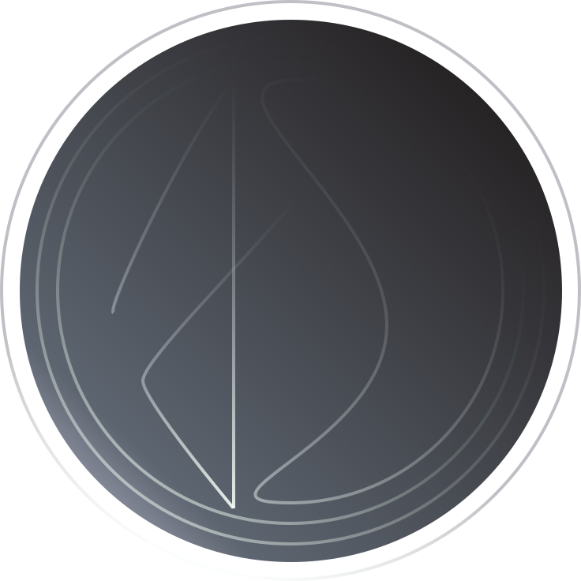

  
  <h1 align="center">Seu Pedacinho</h1>
  
Encontre pessoas e empresas de Cachoeira e região

  

    <a align="center" href="https://jayneanderson.github.io/your-piece" target="blank">Acesse o site oficial</a>
  

  

<h2>📚Sumário</h2>
<ul>
  <li><a href="#goal">Objetivo do Seu Pedacinho</a></li>
  <li><a href="#install">Como iniciar o projeto</a></li>
  <li><a href="#status">Status do projeto</a></li>
  <li><a href="#checklist">Checklist</a></li>
  <li><a href="#lessons">Aprendizados</a></li>
  <li><a href="#technologies">Tecnologias utilizadas</a></li>
  <li><a href="#autor">Autor</a></li>
</ul>

<h2 id="goal">🍫 Seu Pedacinho</h2>

Este repositório tem como objetivo armazenar o código do front-end da aplicação 
  <a href="https://jayneanderson.github.io/your-piece" target="blank">Seu Pedacinho
  </a>, cujo objetivo é destacar e concentrar pessoas empreendedoras e empresas pequenas da cidade de
  <a href="https://pt.wikipedia.org/wiki/Cachoeira_(Bahia)" target="blank">Cachoeira - BA
  </a> e região.

<h2 id="install">Como iniciar o projeto localmente</h2>
<ol>
  <li>
    
Clone o projeto:

    <code>git clone https://github.com/Jayneanderson/your-piece.git</code>
  </li>
  <li>
    
Entre no diretório:

    <code>cd your-piece</code>
  </li>
  <li>
    
Instalar as dependências:

    <code>npm install</code>
  </li>
  <li>
    
Iniciar o projeto:

    <code>npm run dev</code>
  </li>
</ol>
<h2 id="status">🚧 Status</h2>

Em desenvolvimento

<h2 id="checklist">📜 Checklist</h2>
<ul>
  <li>[ ] <b>Features</b></li>
    <ul>
      <li>[x] Criar banner</li>
      <li>[x] Criar cards </li>
      <li>[x] Criar filtros
        <ul>
          <li>[x] Filtro por nome</li>
          <li>[x] Filtro por tipo de empresa</li>
          <li>[x] Filtro por cidade</li>
        </ul>
    <li>[x] Ordenar por nome
      <ul>
        <li>[x] Ordem alfabética (de A a Z)</li>
        <li>[x] Ordem alfabética (de Z a A)</li>
      </ul>
    </li>
    <li>[x] Responsividade</li>
    <li>[ ] Recursos de acessibilidade</li>
    </ul>
  </li>
    <li>[ ] <b>Ajustes</b>
      <ul>
        <li>[ ] Ajustar distribuição de cards</li>
      </ul>
    </li>
</ul>
<h2 id="lessons">📈 Principais Aprendizados</h2>
<ul>
  <li>Conceitos de Atomic Design</li>
  <li>Aplicação de Atomic Desing para construção de um Design System</li>
</ul>
<h2 id="technologies">💻 Tecnologias Utilizadas</h2>
<ul>
    <li>
      
      <b>React + Vite</b>
    </li>
    <li>
      
      <b>TypeScript</b> para tipar durante o desenvolvimento
    </li>
    <li>
      
      <b>ESLint</b> para definir regras de implementação
    </li>
    <li>
      
      <b>Prettier</b> para formatação automática de 
    </li>
    <li>
      
      <b>GitHub</b> para Continuos Delivery e deploy da aplicação
    </li>  
</ul>
<h2 id="autor">🤖‍ Autor</h2>

Me chama para tomar um café:

  
  

